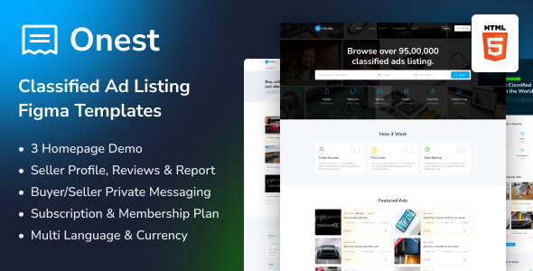

# [Templatecookie](https://templatecookie.com)
Templatecookie.com creates quality templates and php scripts. Templatecookie has many free HTML & Figma templates available for professional use. Templatecookie is famous for its premium PHP Scripts available on [Codeanyon Marketplace](https://codecanyon.net/user/templatecookie). Browse [Templatecookie](https://templatecookie.com) today and discover awesome digital products.

# [Adlisting - Classified Listing HTML Template](https://templatecookie.com/demo/adlisting-classified-listing-html-template)

> Adlisting - classified listing HTML template with 8+ landing pages for different professions.

Check the [Live Demo here](https://adlisting-html.netlify.app/).

## Pages List
- [3 Unique Home Page](https://adlisting-html.netlify.app/)
- [Browse Listing](https://adlisting-html.netlify.app/ad-list)
- [Listing Detail](https://adlisting-html.netlify.app/ad-details)
- [Seller Dashboard](https://adlisting-html.netlify.app/dashboard)
- [User Dashboard](https://adlisting-html.netlify.app/dashboard)
- [About](https://adlisting-html.netlify.app/about)
- [Contact](https://adlisting-html.netlify.app/contact)
- [Pricing Plan](https://adlisting-html.netlify.app/price-plan)
- [Blog List](https://adlisting-html.netlify.app/blog-list)
- [Blog Details](https://adlisting-html.netlify.app/blog-details)
- [FAQ](https://adlisting-html.netlify.app/faq)
- [404](https://adlisting-html.netlify.app/404-error)
- [Authentication](https://adlisting-html.netlify.app/signin)
- and many more

## Framework & Technologies
- (bootstrap4)[https://getbootstrap.com/docs/4.0/getting-started/introduction/)
- (scss)[https://sass-lang.com/)
- (slick)[https://kenwheeler.github.io/slick/]
- (jQuery)[https://jquery.com/]

## Credits
- Design & Developed by [Templatecookie](https://templatecookie.com)

## License
The MIT License (MIT). Please see [License File](LICENSE.md) for more information.

